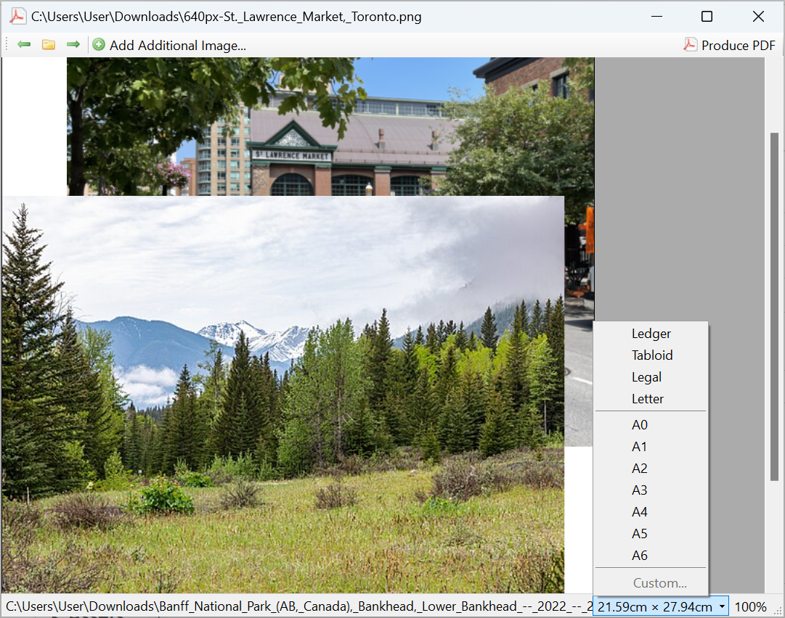

# PicturePDF
PicturePDF converts PNGs, JPEGs and bitmap files into PDF files.

It supports placing multiple images on top of each other, changing the paper
size, and quickly scrolling within a directory. (It currently does not support
resizing images.)



Images are from Wikimedia Commons, of [St. Lawrence Market] and [Banff National Park].

It is currently Windows-only, and is based on .NET with [WinForms].

## Building
Use standard .NET commands to build and publish:

```cmd
dotnet build
```

## License
PicturePDF is licensed underneath the [GNU General Public License], version 3.
The icons `arrow_left.png`, `rainbow.png`, `arrow_right.png`, `folder.png` and
the `page_white_acrobat` files are from the [Silk] collection by Mark James.

[WinForms]: https://docs.microsoft.com/en-us/dotnet/framework/winforms/
[St. Lawrence Market]: https://commons.wikimedia.org/wiki/File:St._Lawrence_Market,_Toronto.png
[Banff National Park]: https://commons.wikimedia.org/wiki/File:Banff_National_Park_(AB,_Canada),_Bankhead,_Lower_Bankhead_--_2022_--_2236.jpg
[GNU General Public License]: https://www.gnu.org/licenses/gpl-3.0.html
[Silk]: http://www.famfamfam.com/lab/icons/silk/
