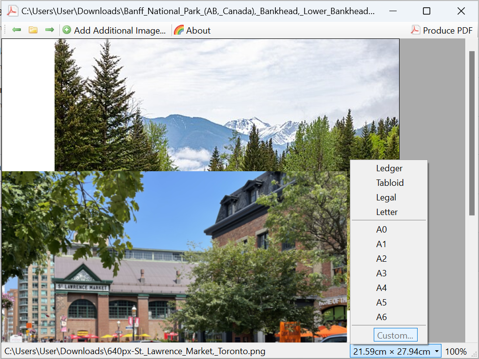

# PicturePDF
PicturePDF is a [WinForms] application for converting PNGs, JPEGs and other
image files into PDF files.

## Building
Use standard .NET Core commands to build and publish.

**Note!** The Designer project will not build, and is due to [issues with
.NET Core supporting the WinForms Designer]. Build the PicturePDF project
instead.

## License
PicturePDF is licensed underneath the [GNU General Public License], version 3.
The icons `arrow_left.png`, `arrow_right.png`, `folder.png` and the
`page_white_acrobat` files are from the [Silk] collection by Mark James
(mjames at gmail dot com).

[WinForms]: https://docs.microsoft.com/en-us/dotnet/framework/winforms/
[issues with .NET Core supporting the WinForms Designer]: https://github.com/dotnet/winforms/issues/147
[GNU General Public License]: https://www.gnu.org/licenses/gpl-3.0.html
[Silk]: http://www.famfamfam.com/lab/icons/silk/
